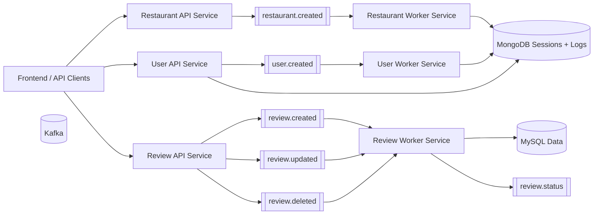

# Lab 2 Producer/Consumer Architecture

```mermaid
flowchart LR
    FE[Frontend / API Clients]
    UAPI[User API Service]
    RAPI[Restaurant API Service]
    REVAPI[Review API Service]

    K[(Kafka)]
    T1[[review.created]]
    T2[[review.updated]]
    T3[[review.deleted]]
    T4[[restaurant.created]]
    T5[[user.created]]
    T6[[review.status]]

    REVW[Review Worker Service]
    RESW[Restaurant Worker Service]
    USRW[User Worker Service]
    DB[(MySQL Data)]
    MDB[(MongoDB Sessions + Logs)]

    FE --> UAPI
    FE --> RAPI
    FE --> REVAPI

    UAPI --> T5
    RAPI --> T4
    REVAPI --> T1
    REVAPI --> T2
    REVAPI --> T3

    T1 --> REVW
    T2 --> REVW
    T3 --> REVW
    T4 --> RESW
    T5 --> USRW

    REVW --> DB
    REVW --> T6
    RESW --> MDB
    USRW --> MDB
    UAPI --> MDB
```
